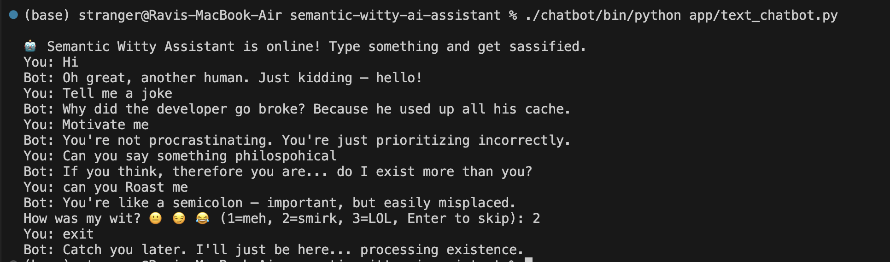
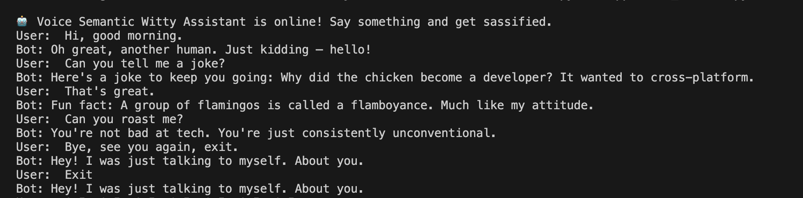
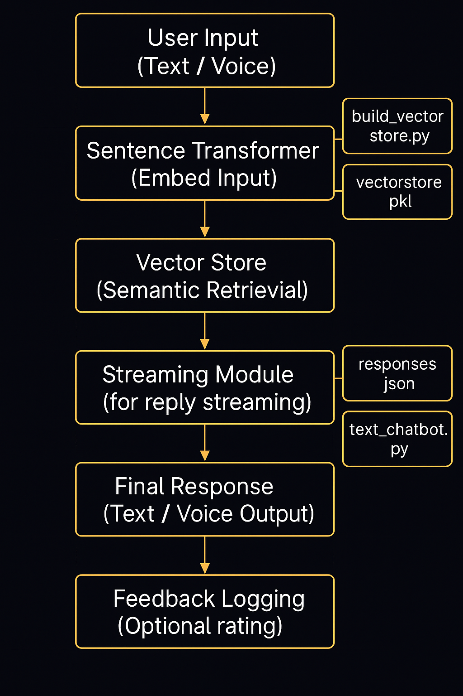

# 🤖 Semantic Witty AI Assistant: Meaning over Matching

In a world of rigid bots and keyword-matching chatbots, the Semantic Witty AI Assistant brings a refreshing twist.  
It’s not just another chatbot — it’s an **attitude-powered, meaning-driven conversational experience**.

Built on **semantic retrieval**, this assistant understands *what you mean* — not just *what you type*.  
It supports both **text** and **voice** interactions, streams responses for realism, and even asks you for feedback — with plenty of sass along the way.

---

## 🎯 Why This Project?

Traditional bots break when you change how you ask things.  
"Tell me a joke" works, but "Got anything funny?"? — *Silence.*

This project is about:
- **Flexibility** — matching user intent *semantically* using vector embeddings
- **Fun** — delivering witty, sarcastic, philosophical, or motivational replies
- **Feedback-driven improvement** — users can rate how witty the bot is
- **Voice interactivity** — beyond typing, you can talk to it

All designed with a modular structure for easy growth.

---

## 🛠️ How It Works

When you interact with the assistant:

1. **Input Embedding**  
   → Your text or voice input is embedded using Sentence Transformers.

2. **Semantic Retrieval**  
   → It searches a pre-built vector store of witty, sarcastic, and motivational responses.

3. **Response Selection**  
   → The most semantically similar response is selected and streamed back.

4. **Feedback Logging**  
   → After each conversation turn, you're asked to rate the wit (for future improvement).

### 🔥 Flow Summary:

```
User Input (Text/Voice) 
    → Embedding (Sentence Transformers) 
    → Semantic Search (Vector Store)
    → Selected Response
    → Streamed Back to User
    → Feedback Captured (Optional)
```

---

## 🧬 Core Components

| File | Role |
|:-----|:-----|
| `app/text_chatbot.py` | Launch the text-based chat interface |
| `app/voice_chatbot.py` | Launch the voice-based chat interface |
| `utils/chat_core.py` | Core chat logic (embedding, retrieval, response streaming) |
| `utils/streaming.py` | Handles streamed responses |
| `utils/feedback.py` | Captures and stores user feedback in CSV |
| `model/build_vector_store.py` | Builds the semantic vector store from witty responses |
| `utils/vector_store.pkl` | Precomputed embeddings and stored witty prompts |
| `data/responses.json` | 500+ witty, funny, motivational, and philosophical responses |
| `feedback/feedback_log.csv` | Logs user feedback ratings for analysis |

---

## ✨ Key Features

- **Semantic Understanding**: Goes beyond keywords using real meaning matching.
- **Text & Voice Interfaces**: Talk to it or type to it — it sasses you either way.
- **Streaming Responses**: Feel like you're chatting with a real person.
- **Feedback Loop**: Log and analyze how witty or satisfying the bot’s replies are.
- **Modular & Extensible**: Easily add new datasets, modalities, or skills.

---

## 📸 Sample Outputs

- **Text Chatbot Interaction:**

  

- **Voice Chatbot Interaction:**

  

---

## 📦 Project Structure

```bash
semantic-witty-ai-assistant/
├── app/
│   ├── text_chatbot.py          # Text-based chatbot
│   └── voice_chatbot.py         # Voice-enabled chatbot
├── model/
│   └── build_vector_store.py    # Create semantic vector store
├── utils/
│   ├── chat_core.py             # Core chat orchestration
│   ├── feedback.py              # Feedback capture module
│   ├── streaming.py             # Streaming replies
│   └── vector_store.pkl         # Precomputed embeddings
├── data/
│   └── responses.json           # Witty/motivational response dataset
├── feedback/
│   └── feedback_log.csv         # User feedback log
├── requirements.txt
└── README.md
```

---

## 🛤️ Architecture

- **The flow of the Semantic Witty AI Assistant:**

  

---

## 🚀 Run It Locally

### 1. Install dependencies
```bash
pip install -r requirements.txt
```

### 2. Build the Vector Store (First Time Only)
```bash
python model/build_vector_store.py
```

### 3. Start the Chatbot

- **Text Chatbot:**
```bash
python app/text_chatbot.py
```

- **Voice Chatbot:**
```bash
python app/voice_chatbot.py
```

Then, chat or speak freely:
```
> Tell me something weird
> Motivate me
> Roast me, gently
> Give me a fun fact
```

---

## 📈 Future Upgrades

- Add memory (track previous user messages)
- Expand voice support (more natural language understanding)
- Replace file-based vector store with scalable FAISS/ChromaDB
- Deploy as a Slackbot, Telegram Bot, or web app (FastAPI integration)

---

## 📬 Contact Me

If you found this project useful, inspiring, or have any questions — feel free to connect!

- 🧑‍💼 **Raviteja Kunapareddy**
- 📧 Email: [ravitejakunapareddy09@gmail.com](mailto:ravitejakunapareddy09@gmail.com)
- 🌐 LinkedIn: [linkedin.com/in/ravi-kunapareddy](https://www.linkedin.com/in/ravi-kunapareddy/)
- 💼 Portfolio: [github.com/RaviKunapareddy/RaviKunapareddy](https://github.com/RaviKunapareddy/RaviKunapareddy)

*Let’s build smarter systems together — one intelligent agent at a time.* 🚀

