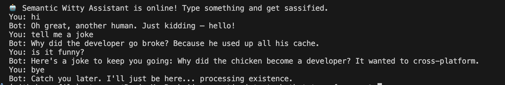

# 🤖 Semantic Witty AI Assistant

A conversational AI chatbot with *personality*. This assistant doesn’t rely on fixed intent categories or rigid rules. Instead, it uses **sentence embeddings** and **semantic similarity** to understand what you mean — not just what you say.

After building a basic intent classifier using Bag-of-Words and TensorFlow, I wanted to go deeper: 
What if we could match user inputs based on *meaning*, not just keywords?

This project is the answer. It’s the second step in my NLP journey — a smarter, more flexible, and a whole lot funnier assistant.

---

## 🎯 Why I Built This

Too often, classic NLP bots feel stiff. You say "Tell me a joke", and it matches a tag. Say "Got anything funny?" and... nothing.

I wanted:
- A chatbot that **understands variations** in how people speak
- A system that doesn't need to be re-trained every time we add new examples
- A **fun, sassy, sarcastic** assistant that feels more like a clever friend than a machine

And that’s exactly what this is. 💬

---

## 🧠 How It Works

```text
User Input → Embedding (SentenceTransformer)
           → Cosine Similarity against Pre-Embedded Prompts
           → Closest Match → Pre-written Witty Response 🔥
```

### 🧬 Core Components
- `responses.json` → 500+ prompts + witty responses
- `SentenceTransformer` → Transforms input + prompts into embeddings
- `vector_store.pkl` → Stores precomputed embeddings for fast retrieval
- Cosine similarity → Finds the most semantically relevant response

---

## 📂 Project Structure

```bash
semantic-intent-chatbot-transformers/
├── app/
│   └── chatbot.py                  # Chat loop with similarity search
├── model/
│   └── build_vector_store.py      # Embeds prompts and builds vector store
├── data/
│   └── responses_witty_500.json   # 500+ conversational examples
├── utils/
│   └── vector_store.pkl           # Pickled embeddings and responses
├── assets/
│   └── semantic-chat-output.png   # Screenshot for README
├── requirements.txt
└── README.md
```

---

## 🖥️ Run It Locally

### 1. Install dependencies
```bash
pip install -r requirements.txt
```

### 2. Build vector store (if needed)
```bash
python model/build_vector_store.py
```

### 3. Start the chatbot
```bash
python app/chatbot.py
```

Then just type like you would to a human:
```
> Hey, you there?
> What’s your favorite meme?
> Insult me, gently
> Drop a weird fact
```

---

## 💬 Sample Interaction



> ⚠️ This bot will occasionally roast you. With love. And sarcasm.

---

## 🚀 What's Next
- Swap `responses.json` for a vector database (FAISS / ChromaDB)
- Add memory to track previous messages
- API-ready wrapper using FastAPI
- Deploy as a fun Slackbot or Telegram bot

---

## ✨ What This Project Shows
- Your progression from classic NLP to semantic retrieval
- Comfort with embeddings, vector stores, and cosine similarity
- Ability to blend ML + humor for a memorable UX
- And most importantly — personality matters in AI 😎

---

## 👨‍💻 Author
**Raviteja Kunapareddy**  
[GitHub](https://github.com/RaviKunapareddy) ・ [LinkedIn](https://www.linkedin.com/in/ravitejak99/) ・ [Email](mailto:ravitejakunapareddy09@gmail.com)

Let’s build assistants that don’t just *work* — but spark joy ⚡
